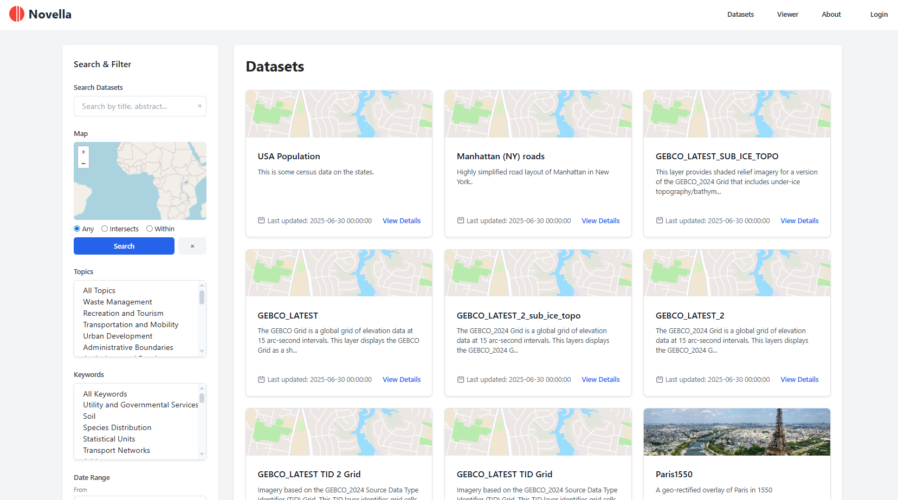

# Novella

[](https://novella.docs.acugis.com/en/latest/?badge=latest)

Novella is a lightweight Spatial Data Catalog and Portal




## Features

- Metadata entry form following ISO 19115 + INSPIRE standards
- PostgreSQL database storage
- XML export functionality
- RESTful API endpoints
- Small footprint

## Requirements

- Ubuntu 24.04 LTS
- PHP 8.1 or higher
- PostgreSQL 16 or higher
- Apache 2.4
- Composer

## Installation on Ubuntu 24.04

1. Install PostgreSQL and Novella with demo:

```bash
   git clone https://github.com/AcuGIS/Novella.git
   cd Novella
   ./installer/postgres.sh
   ./installer/novella_ubuntu24.sh
```

2. To skip demo or qgis support use --no-demo and/or --no-qgis option:
```bash
./installer/novella_ubuntu24.sh --no-demo --no-qgis
```

Optionally, provision and SSL certificate using:

```bash
 apt-get -y install python3-certbot-apache
 certbot --apache --agree-tos --email hostmaster@${HNAME} --no-eff-email -d ${HNAME}
```

Default credentials

   - Username: admin
   - Password: Novella


## Database Structure

The application uses the following main tables:
- `metadata_records`: Core metadata information
- `citations`: Citation information
- `contacts`: Contact information
- `geographic_extents`: Geographic bounding boxes
- `temporal_extents`: Temporal coverage
- `spatial_representations`: Coordinate system information
- `constraints`: Use constraints
- `inspire_metadata`: INSPIRE-specific metadata

## Security Considerations

For production:
   - Set `APP_ENV=production` and `APP_DEBUG=false` in `.env`

## Troubleshooting

1. Check Apache error logs:
```bash
sudo tail -f /var/log/apache2/novella-error.log
```

2. Check application logs:
```bash
tail -f /var/www/novella/storage/logs/app.log
```

3. Verify PHP configuration:
```bash
php -i | grep "php.ini"
```

4. Test database connection:
```bash
psql -U your_username -d novella -c "\dt"
```

## License

MIT License
