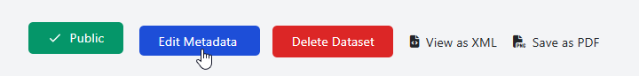
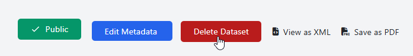

.. This is a comment. Note how any initial comments are moved by
   transforms to after the document title, subtitle, and docinfo.

.. demo.rst from: http://docutils.sourceforge.net/docs/user/rst/demo.txt

.. |EXAMPLE| image:: static/yi_jing_01_chien.jpg
   :width: 1em

**********************
Datasets
**********************

.. contents:: Table of Contents
Overview
==================

Datasets can be added Manually or via Harvesting

For harvesting, see Harvest section.

Add Dataset
================

To manually add a dataset, complete the required fields

Click Add Metadata in top menu

.. image:: ../../_static/metadata-add-1.png

Enter the values for Identication Information section

.. image:: ../../_static/metadata-add-2.png

Enter the values for the Citation section

.. image:: ../../_static/metadata-add-3.png

If using a WMS Service, enter the url and click Fetch Layers

.. image:: ../../_static/metadata-add-4.png

Select layer from dropdown

.. image:: ../../_static/metadata-add-5.png

Note that Layer appears and Spatial Extent fields are populated:

.. image:: ../../_static/metadata-add-6.png

For a GIS Data File, such as GeoPackage, GeoTIFF, Shapefile, etc....

Click Choose File Button

.. image:: ../../_static/metadata-add-7.png

Select the data file you wish to upload

.. image:: ../../_static/metadata-add-8.png

Note that Spatial Extent fields are populated and Bounding Box appears

.. image:: ../../_static/metadata-add-9.png

Populate the Temporal Extent and Spatial Representation fields

.. image:: ../../_static/metadata-add-10.png

Populate the Constraints fields

.. image:: ../../_static/metadata-add-11.png

Populate the Data Quality fields

.. image:: ../../_static/metadata-add-12.png

Populate the INSPIRE Metadata fields

.. image:: ../../_static/metadata-add-13.png

Populate the Additional Metadata fields

.. image:: ../../_static/metadata-add-14.png

Populate the Distribution Information fields

.. image:: ../../_static/metadata-add-15.png

Edit Dataset
================

To edit a dataset, click the Edit Metadata button

Delete Dataset
================

To delete a dataset, click the Delete Dataset button

