.. This is a comment. Note how any initial comments are moved by
   transforms to after the document title, subtitle, and docinfo.

.. demo.rst from: http://docutils.sourceforge.net/docs/user/rst/demo.txt

.. |EXAMPLE| image:: static/yi_jing_01_chien.jpg
   :width: 1em

**********************
Datasets
**********************

.. contents:: Table of Contents
Overview
==================

Data Sources are added via the Data Source menu.

By default, Jasper Report Publisher includes support for the following:

PostgreSQL (JNDI)
Oracle (JDBC and JNDI)
MySQL (JNDI)
MSSQL (JNDI)

Add Dataset
================

To manually add a dataset, complete the required fields

Click Add Metadata in top menu

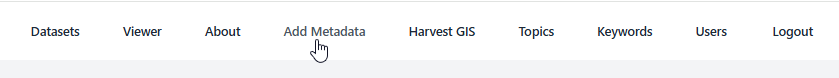

Enter the values for Identication Information section

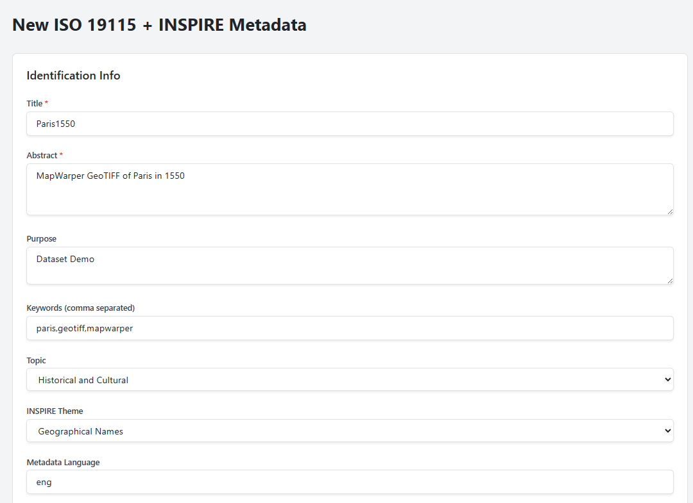

Enter the values for the Citation section

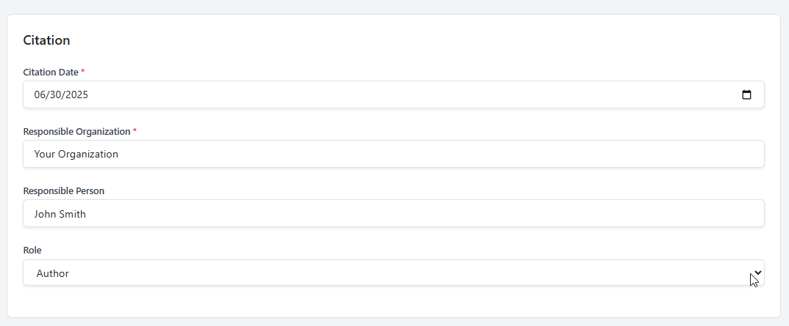

If using a WMS Service, enter the url and click Fetch Layers

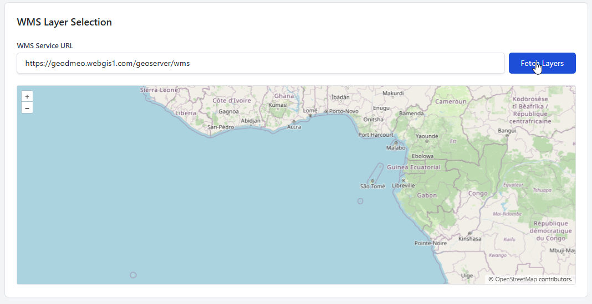

Select layer from dropdown

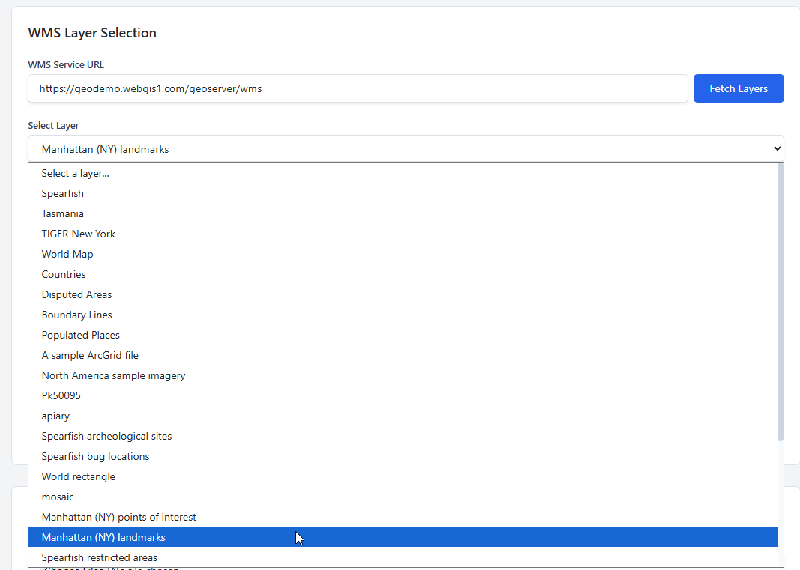

Note that Layer appears and Spatial Extent fields are populated:

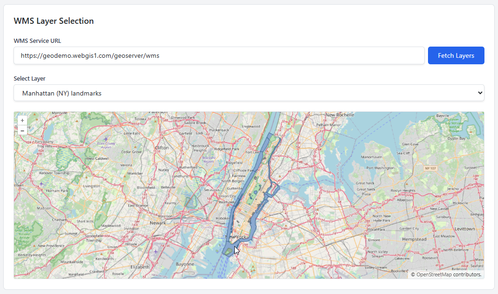

For a GIS Data File, such as GeoPackage, GeoTIFF, Shapefile, etc....

Click Choose File Button

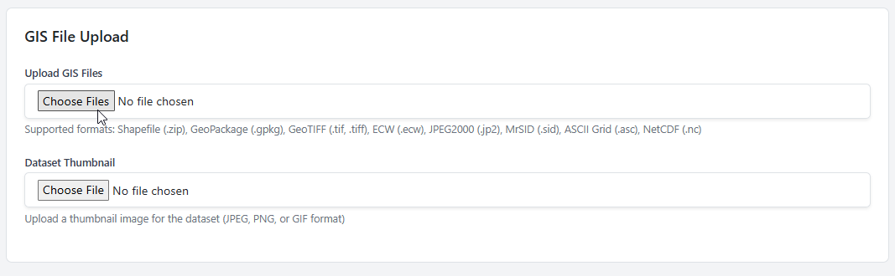

Select the data file you wish to upload

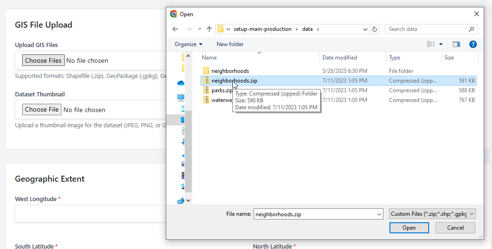

Note that Spatial Extent fields are populated and Bounding Box appears

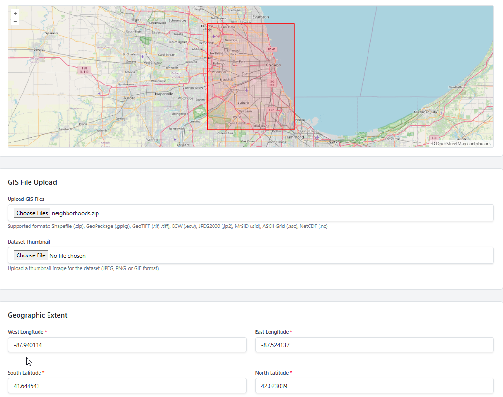

Populate the Temporal Extent and Spatial Representation fields

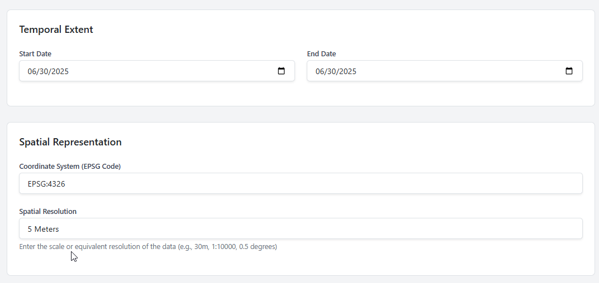

Populate the Constraints fields

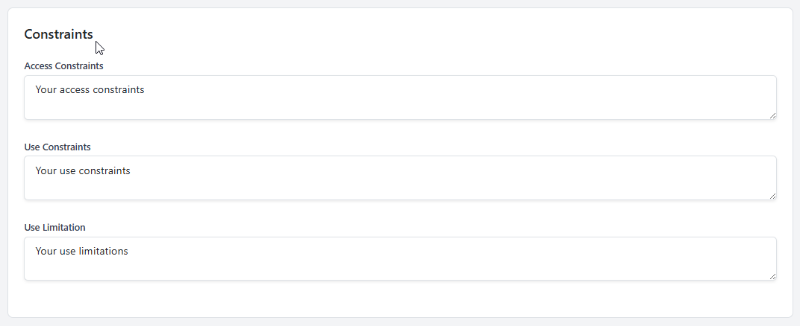

Populate the Data Quality fields

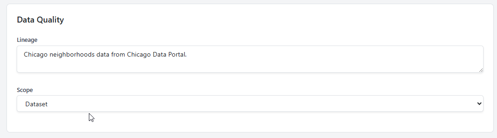

13

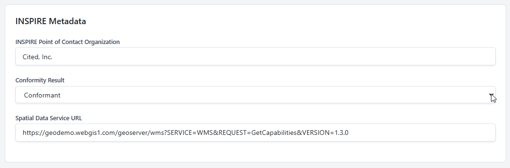

14

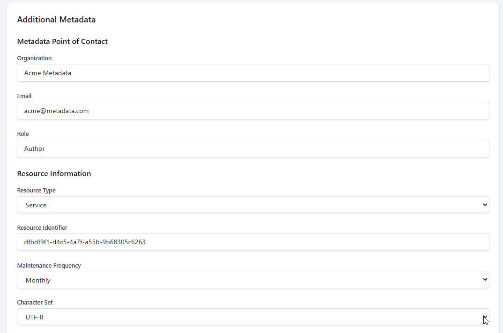

15

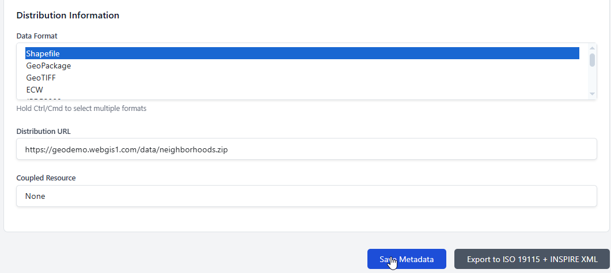

Select Type (JNDI or JDBC)

Data Source Name (this should match name used in Jasper Report Adapter)

URL: The JDBC URL (e.g. jdbc:postgresql://localhost:5432/beedatabase)

Username

Password

You can add as many Data Sources as you wish to:

.. image:: ../../_static/data-source-2.png

Restart Tomcat
================

You must restart Tomcat after adding or editing Data Sources in order to pick up the new configuration

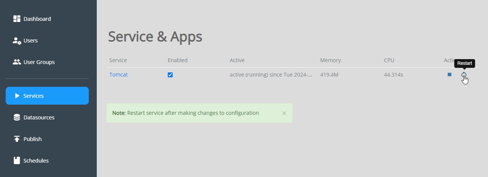

