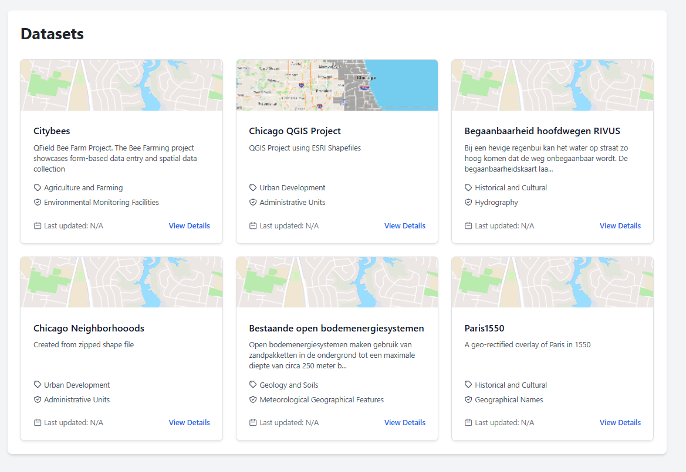
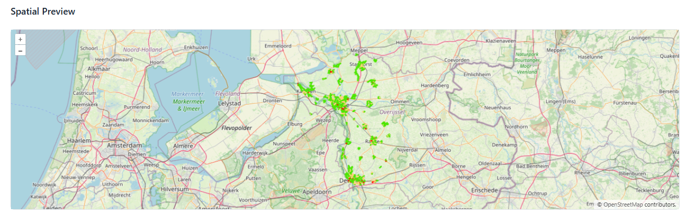
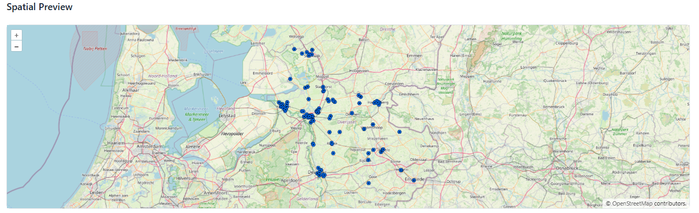
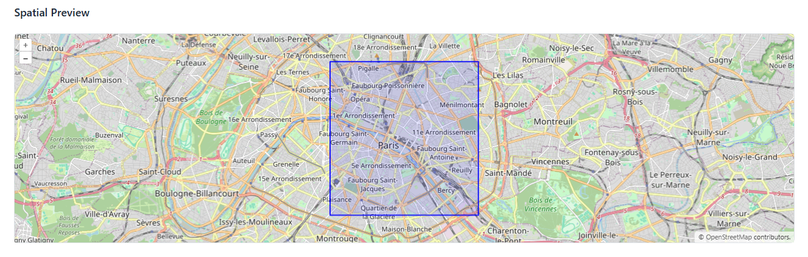
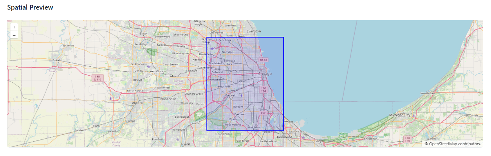
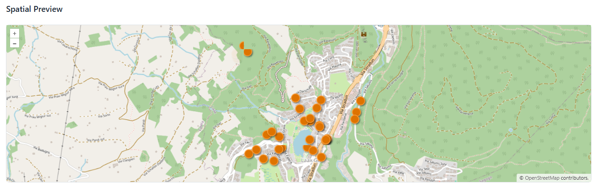
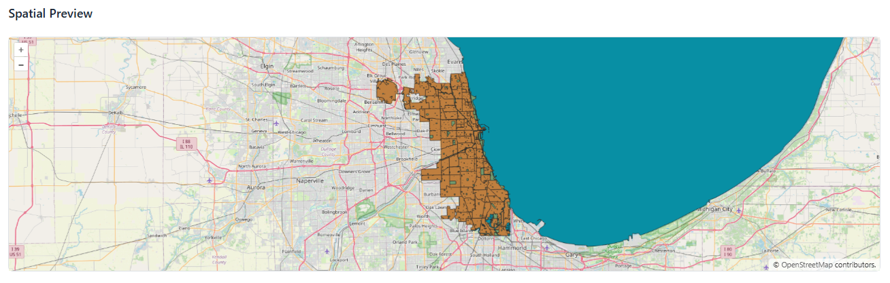

.. This is a comment. Note how any initial comments are moved by
   transforms to after the document title, subtitle, and docinfo.

.. demo.rst from: http://docutils.sourceforge.net/docs/user/rst/demo.txt

.. |EXAMPLE| image:: static/yi_jing_01_chien.jpg
   :width: 1em

**********************
Demo Data
**********************

.. contents:: Table of Contents

Overview
==================

Novella installs with 6 sample datasets.

WMS Demos
================

The WMS demo sample is from overijssel.nl

 https://services.geodataoverijssel.nl/geoserver/LIP/wms

Bestaande open bodemenergiesystemen

Begaanbaarheid hoofdwegen RIVUS

  
GeoTIFF Demo
================

Paris in 1550

ShapeFile Demo
================

Chicago Neighborhooods

QGIS Demos
================

QGIS Citybees

Chicago QGIS Project

Delete Demos
===================

To delete demo data, simply delete the dataset as normal

