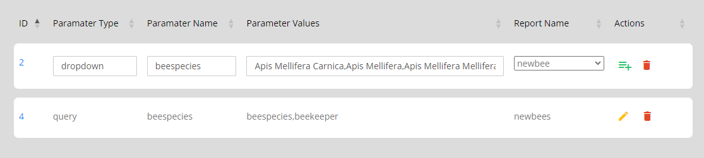
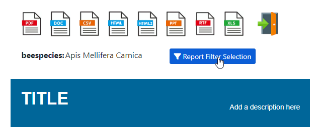
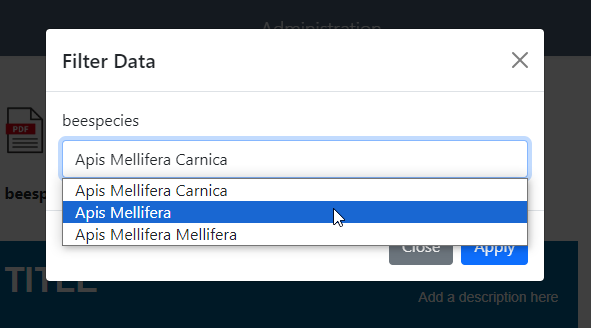
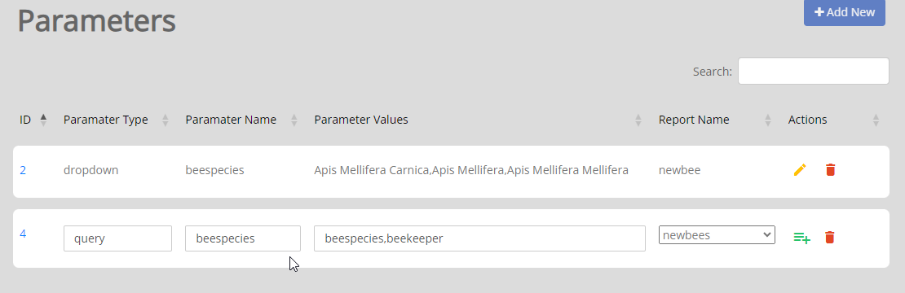
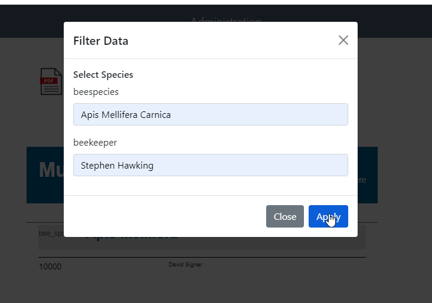

.. This is a comment. Note how any initial comments are moved by
   transforms to after the document title, subtitle, and docinfo.

.. demo.rst from: http://docutils.sourceforge.net/docs/user/rst/demo.txt

.. |EXAMPLE| image:: static/yi_jing_01_chien.jpg
   :width: 1em

**********************
Harvest
**********************
.. contents:: Table of Contents
Overview
==================

The OAi-PMH Harvest function can be used to import dataasets

Create
=====================

To create a Harvest, give your Harvest a name:

https://wms.gebco.net/mapserv?request=getcapabilities&service=wms&version=1.3.0

Enter the following information:

* Paramater Type	- Enter 'dropdown'
* Paramater Name - The name of Paramater
* Paramater Values - Enter a comma separated list of values (in our example, Apis Mellifera Mellifera, Apis Mellifera, and Apis Mellifera Carnica)
* Report Name - Select the report Parameter will be applied to.  

Once you save the paramter, it will now appear on the Report Dashboard as below:

.
On click, the dropdown/LOV will display as below:

Query Parameter
=====================

To add a Query parameter, click the "Add New" button at top.

Enter the following information:

* Paramater Type	- Enter 'query'
* Paramater Name - Display name of Paramater
* Paramater Values - Comma separated list of Parameters to be used
* Report Name - Select the report Parameter will be applied to.

In the example below, the Values we entered are the Jasper parameters Cost_Greater_Than and Cost_Less_Than.

Edit Parameter
===================
To edit a Parameter entry, click the Edit icon

Delete Parameter
===================
To delete a Parameter entry, click the Delete icon

