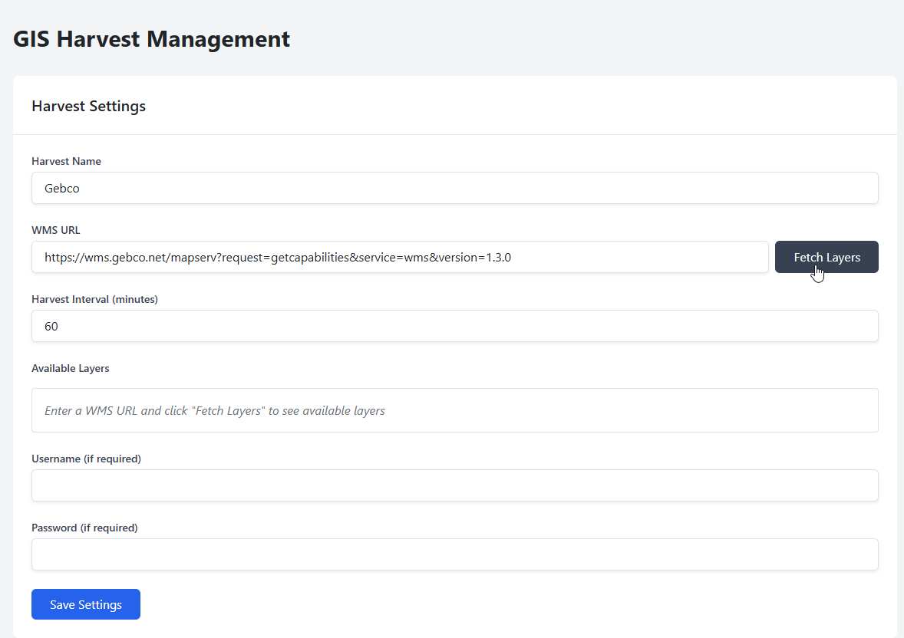
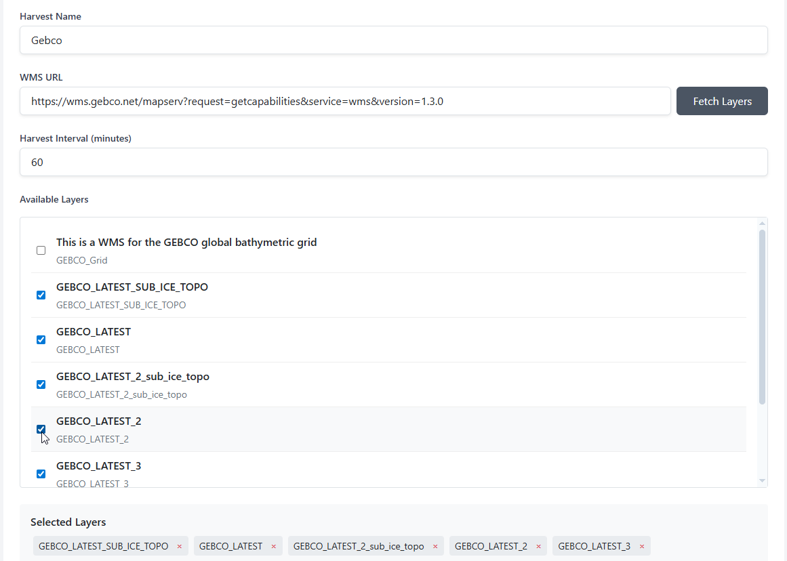
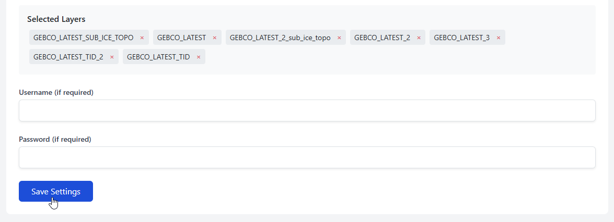
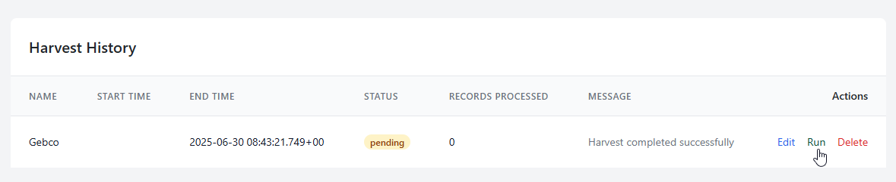
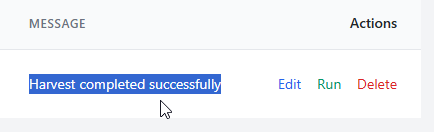
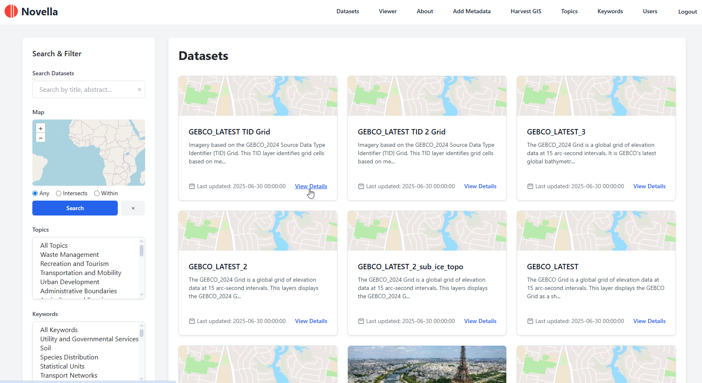
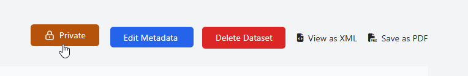
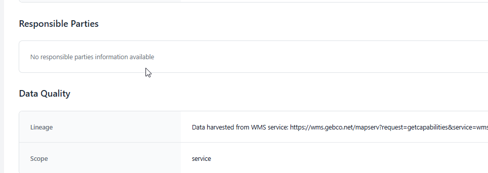

.. This is a comment. Note how any initial comments are moved by
   transforms to after the document title, subtitle, and docinfo.

.. demo.rst from: http://docutils.sourceforge.net/docs/user/rst/demo.txt

.. |EXAMPLE| image:: static/yi_jing_01_chien.jpg
   :width: 1em

**********************
Harvest
**********************
.. contents:: Table of Contents
Overview
==================

The OAi-PMH Harvest function can be used to import dataasets

Create
=====================

To create a Harvest, give your Harvest a name, enter the WMS Url, and click Fetch Layers

For example:  https://wms.gebco.net/mapserv?request=getcapabilities&service=wms&version=1.3.0

Select the layers you wish to harvest

Click the Save button

The Harvest job should now appear in Harvest History as shown below.

Click the Run button to begin harvesting

You should see a message that harvest is completed

Harvested Datasets
=====================

With the harvest completed, you should now see the harvested datasets

It's important to note that by default, all harvested datasets are set to Private.

This allows you a chance to reivew and edit datasets prior to publication

Edit
=====================

Harvested datasets can be edited like any other datasets.

This is useful for when the harvested data contains incomplete information, such as Responsible Parties below.

.. warning:: 
   Unless you update the harvest query, scheduled or subsequent harvests will overwrite any edits.

Delete
=====================

To 

.. image:: ../../_static/parameter-3-1.png

Enter the following information:

* Paramater Type	- Enter 'query'
* Paramater Name - Display name of Paramater
* Paramater Values - Comma separated list of Parameters to be used
* Report Name - Select the report Parameter will be applied to.

In the example below, the Values we entered are the Jasper parameters Cost_Greater_Than and Cost_Less_Than.

.. image:: ../../_static/parameter-report-5-1.png

Edit Parameter
===================
To edit a Parameter entry, click the Edit icon

Delete Parameter
===================
To delete a Parameter entry, click the Delete icon

