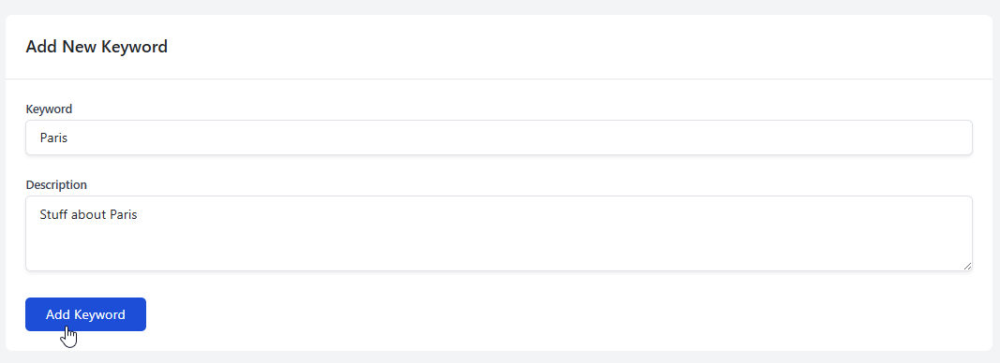

.. This is a comment. Note how any initial comments are moved by
   transforms to after the document title, subtitle, and docinfo.

.. demo.rst from: http://docutils.sourceforge.net/docs/user/rst/demo.txt

.. |EXAMPLE| image:: static/yi_jing_01_chien.jpg
   :width: 1em

**********************
Keywords
**********************
.. contents:: Table of Contents
Overview
==================

Keywords (GMET) can be managed via the Keyword page.

Add Keyword
=====================

To add a Keyword, enter the Keyword and a descriptiona and click Add Keyword

Keyword will now appear in Dataset creation dropdown as well as Keyword Search on the home page.

Edit Keyword
=====================

To edit a Keyword, click the Edit link for the Keyword

Delete Keyword
=====================

To delete a Keyword, click the Delete link for the Keyword

