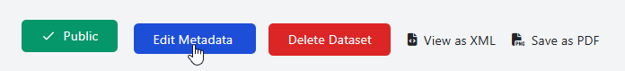
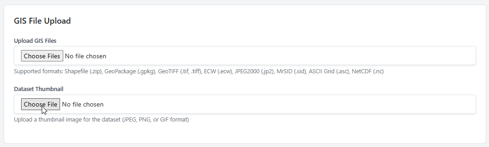

.. This is a comment. Note how any initial comments are moved by
   transforms to after the document title, subtitle, and docinfo.

.. demo.rst from: http://docutils.sourceforge.net/docs/user/rst/demo.txt

.. |EXAMPLE| image:: static/yi_jing_01_chien.jpg
   :width: 1em

**********************
Custom Thumbnail
**********************

.. contents:: Table of Contents
Overview
==================

By default, datasets use a default thumbnail located at::  

   storage/uploads/thumbnails/default.png

You can set custom thumbnails for your datasets by following below.

Go to the dataset and click Edit Metadata

Upload the custom thumbnail

