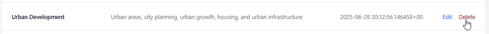

.. This is a comment. Note how any initial comments are moved by
   transforms to after the document title, subtitle, and docinfo.

.. demo.rst from: http://docutils.sourceforge.net/docs/user/rst/demo.txt

.. |EXAMPLE| image:: static/yi_jing_01_chien.jpg
   :width: 1em

**********************
Topics
**********************

.. contents:: Table of Contents
Overview
==================

Topics can be managed via the Topics page.

Add Topic
=====================

To add a Topic, enter the Keyword and a descriptiona and click Add Topic

Topic will now appear in Dataset creation dropdown as well as Keyword Search on the home page.

Edit Topic
=====================

To edit a Topic, click the Edit link for the Keyword

Delete Topic
=====================

To delete a Topic, click the Delete link for the Topic

