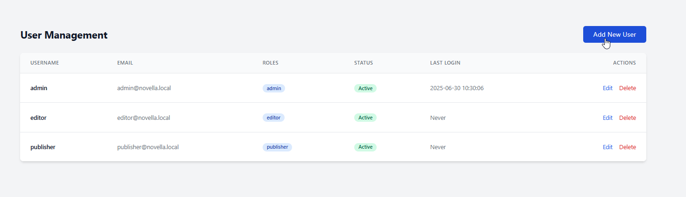
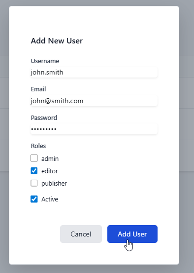
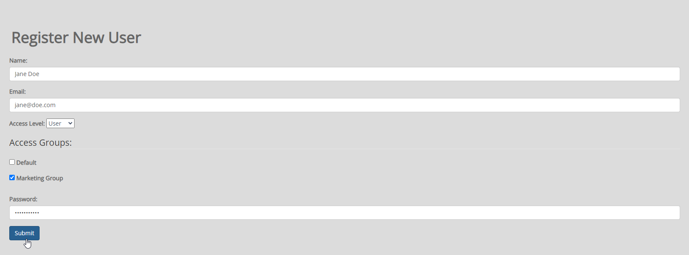
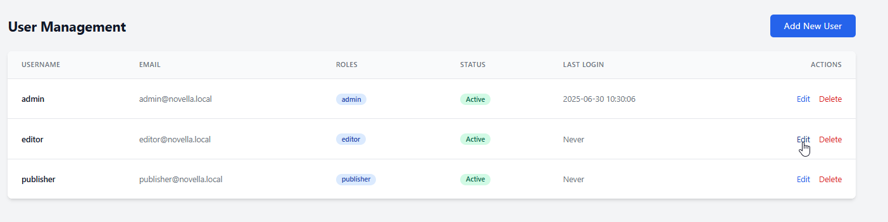
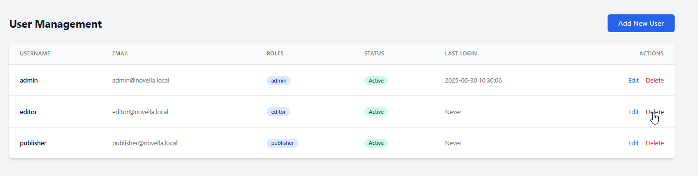

.. This is a comment. Note how any initial comments are moved by
   transforms to after the document title, subtitle, and docinfo.

.. demo.rst from: http://docutils.sourceforge.net/docs/user/rst/demo.txt

.. |EXAMPLE| image:: static/yi_jing_01_chien.jpg
   :width: 1em

**********************
Users
**********************
.. contents:: Table of Contents
Overview
==================

Novella includes basic role based permissions.

User Types
==================

Novell supports the following User types.

Additional types can be added.

- Admins:  All system privilages
- Publisher: Can publish and harvest datasets
- Editor:   Can edit datasets

Add New User
================

To create a new user, click on Users on the left menu.

Click the Add User button

Enter the required information and be sure to set the Access Level (Admin, Publisher, or Editor)

If the Group(s) you wish to add To add the user to are already created, you can add them as below:

Edit User
===================

You can edit users via the Edit link.

Delete User
===================

You can delete users via the Delete link.

