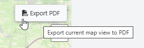

.. This is a comment. Note how any initial comments are moved by
   transforms to after the document title, subtitle, and docinfo.

.. demo.rst from: http://docutils.sourceforge.net/docs/user/rst/demo.txt

.. |EXAMPLE| image:: static/yi_jing_01_chien.jpg
   :width: 1em

**********************
Viewer
**********************

.. contents:: Table of Contents
Overview
==================

The Viewer allows you to drag datasets onto the map canvas.

Add Datasets
================

Select a dataset to drag on to the maps canvas.

The map should zoom to the dataset

You can add as many layers as you wish to.

Visible layers and current map view can be exported to PDF

