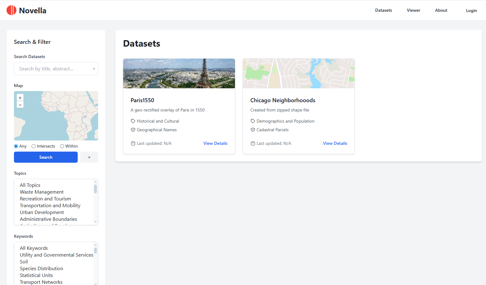

************
Installation
************

Installation is done via the install scripts located in the /installer directory.

System Requirements
=======================
* PostgreSQL >= 16
* PHP >= 8.1
* 2 GB RAM
* 5 GB Disk
* Tested on Ubuntu 24

Running the Installer
=======================

Download the Jasper Report Publisher and unzip:

.. code-block:: console

    git clone https://github.com/AcuGIS/Novella.git
    cd Novella
    

Run the installers in sequence below:

.. code-block:: console
 
    cd Novella
   ./installer/postgres.sh
   ./installer/novella_ubuntu24.sh 
   

Optionally, run below to provision SSL using letsencrypt:

.. code-block:: console

   apt-get -y install python3-certbot-apache

   certbot --apache --agree-tos --email hostmaster@yourdomain.com --no-eff-email -d yourdomain.com

Navigate to https://yourdomain.com:

Sample Data
===================

The default installation include two sample datasets.

